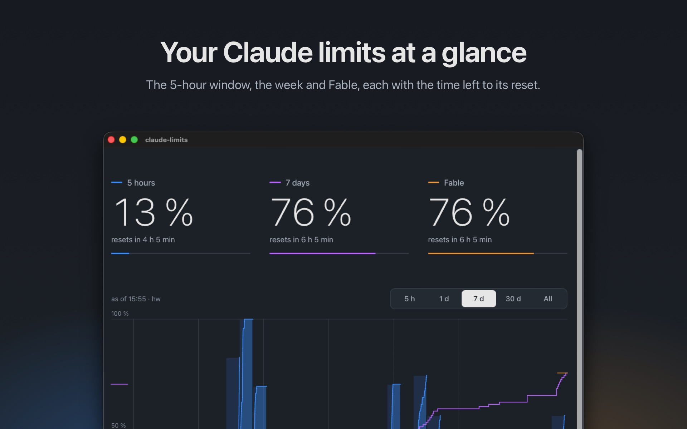
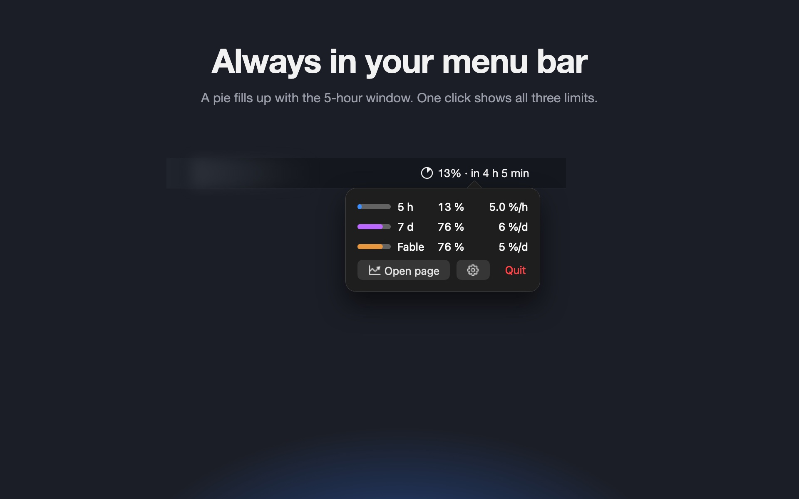
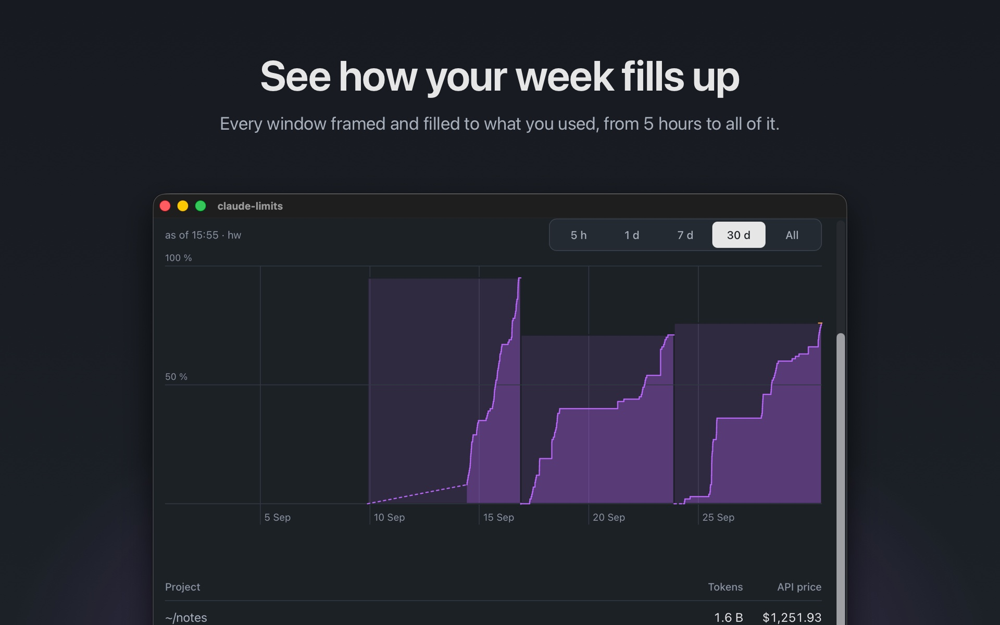
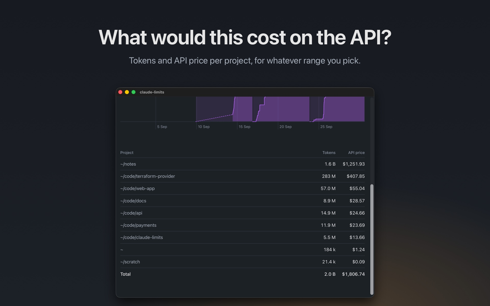
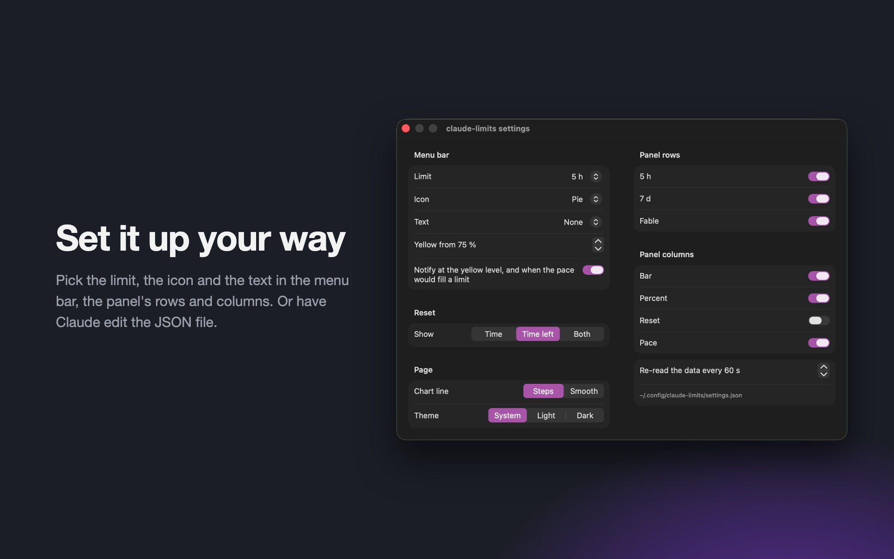
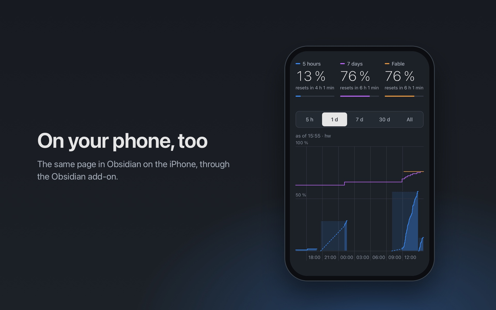

# claude-limits

**Your Claude plan limits, always in view.** The 5-hour window, the weekly limit and the weekly Fable limit, in your Mac's menu bar and on a page with their whole history. Free: no sign-up, no server, nothing to host.



`/usage` tells you where you stand when you ask. claude-limits tells you all the time:

- **At a glance.** A pie in the menu bar fills up with the 5-hour window. One click shows all three limits and when they reset.
- **With history.** Every window on a chart, from the last 5 hours to everything ever recorded, so you see how fast a week fills up.
- **With a price tag.** Tokens per folder, agent, session, source or machine, and what they would cost on the API.
- **No polling.** Claude Code's status line records the limits on every turn you take.

<table>
  <tr>
    <td></td>
    <td></td>
  </tr>
  <tr>
    <td></td>
    <td></td>
  </tr>
</table>

macOS only.

## Setup

Needs macOS, Claude Code signed in with a Claude subscription, and `jq` (`brew install jq`). The menu bar item also needs `swiftc` (`xcode-select --install`).

```sh
git clone https://github.com/Reconnact/claude-limits.git ~/claude-limits
~/claude-limits/install
```

`install` makes the shared data folder, sets Claude Code's status line and starts the menu bar item at login. Run it again at any time; `./install --no-menubar` leaves out the menu bar.

The next Claude Code turn records the limits. Click the pie in the menu bar, or open the page straight away:

```sh
open ~/claude-limits/index.html
```

That's it.

### You already have a status line

`install` leaves your status line alone and prints two lines to add to it. They pass the status line's input to `collect`:

```bash
INPUT="$(cat)"
IFS=$'\t' read -r H5 D7 < <("$HOME/claude-limits/collect" <<<"$INPUT" 2>/dev/null)
```

`H5` and `D7` then hold the rounded percentages, `-` when a window is missing, for your own status line text.

### Several macOS accounts

Run `install` once in each account. Every account writes its own file into `/Users/Shared/claude-limits`, and the page and menu bar read all of them. Accounts on the same Claude login report the same limits, so the page shows one line per limit.

### Tokens from another machine

The limits belong to the Claude account, so the page shows every machine's turns. The token table shows only the transcripts `tally` has read, and it reads this Mac's. On a Linux box that runs Claude Code too, `tally` needs bash, jq and the transcripts and nothing else:

```sh
CLAUDE_LIMITS_DIR=~/claude-limits-data ~/claude-limits/tally
```

writes `<user>-tokens.js` there, from cron say. The folder has to be there: without it `tally` says so on stderr and exits 1, so a cron job fails instead of running quietly. Bring it over under a name of its own, list that name once, and the page adds it up, with Machine as one more split:

```sh
rsync server:claude-limits-data/jochen-tokens.js /Users/Shared/claude-limits/server-tokens.js
echo 'SOURCES.push("server");' >> /Users/Shared/claude-limits/sources.js
```

`tally` uses nothing from macOS, but it has only been run there.

### On your phone



[claude-limits for Obsidian](https://github.com/Reconnact/claude-limits-obsidian) shows the page inside Obsidian, on the Mac and on the phone. Your vault's sync carries the data along.

## The page

- a tile per limit with the time to its reset
- a tick on each bar marks how much of the window has passed: a fill past it is faster than the window allows; under the bar, the pace of the last hour, of the last day for the weekly limits, and, when it fills the window before the reset, the time that happens
- the buttons switch the chart between 5 hours, 1 day, 7 days, 30 days and everything (`?days=5h`, `1`, `7`, `30`, `all`)
- a gap between snapshots is idle time: the value holds until its window resets, then 0
- the chart frames each 5 h window up to the 7-day range and each weekly window beyond it, as high as its peak, with its usage filled in instead of a line; beyond 7 days the 5 h windows are left out
- the chart runs on to the framed window's reset, a grey line marks now, and from there a dashed line shows where that pace takes each limit: to 100 % where it hits, else to the reset
- "as of" is the last check, which is every Claude Code turn; after 30 minutes without one it shows its age in full contrast
- a table under the chart lists the tokens and their API price for the chosen range, both accounts added up; a switch above it splits them by folder, agent, session, source or machine (`?by=folder`, `agent`, `session`, `source`, `machine`): Agent puts a subagent's tokens under its kind and the rest under the main session, Session names a session by its `/rename` title and otherwise by its folder, Source is the entrypoint of the run, `cli` for a terminal and `sdk-cli` for `claude -p`, Machine the host `tally` counted on
- `?dir=<url>` reads the data from another folder
- `?reset=time`, `countdown` or `both` shows the reset as in the menu bar's settings; `Open page` passes it, opened from disk the page counts down
- `?theme=light` or `dark` overrides the system appearance; `Open page` passes the setting
- `Steps` and `Smooth` next to the range buttons draw the chart with a step at each snapshot or as straight lines from one to the next (`?line=steps`, `smooth`); `Open page` starts with the menu bar's setting

The page reloads itself every minute.

## The menu bar

Shows the 5-hour limit as a pie, from the newest snapshot of any account. A click opens a panel under it with a row per limit: its bar, its value and the pace as `12.6 %/h` (`26 %/d` for the weekly limits), or `full 00:19` when it fills the window first; the reset time too, when `panelColumns` says so. Below, `Open page` (⌘O), which shows the page in a window of its own, fresh on each open, and a gear (⌘,) for the settings; ⌘W or ⌘Q closes either window. `Quit` ends the item; Spotlight starts it again as `Claude limits`, from `~/Applications/Claude limits.app`. It starts at login and re-reads the files every minute. `make uninstall-menubar` removes it.

### Settings

The gear in the panel opens a window for them; they live in `~/.config/claude-limits/settings.json`, one file per macOS account. The window and the file are the same thing: a change in the window saves the file, and an edit to the file, by hand or by Claude, shows in the menu bar and in an open window within a second.

```json
{
  "menuBarLimit": "five_hour",
  "menuBarIcon": "pie",
  "menuBarText": "none",
  "resetFormat": "time",
  "chartLine": "steps",
  "theme": "system",
  "panelLimits": ["five_hour", "seven_day", "fable"],
  "panelColumns": ["bar", "percent", "pace"],
  "warnAt": 80,
  "notify": true,
  "refreshSeconds": 60
}
```

| key | values | default | what it does |
|---|---|---|---|
| `menuBarLimit` | `five_hour`, `seven_day`, `fable`, `highest` | `five_hour` | the limit in the menu bar; `highest` is the one closest to full |
| `menuBarIcon` | `pie`, `bar`, `none` | `pie` | the icon |
| `menuBarText` | `none`, `percent`, `reset`, `both` | `none` | text after the icon, e.g. `23% · in 2 h 13 min` |
| `resetFormat` | `time`, `countdown`, `both` | `time` | the reset as `14:30`, `in 2 h 13 min`, or `14:30 · in 2 h 13 min`, in the menu bar, the notifications and the page from `Open page` |
| `chartLine` | `steps`, `smooth` | `steps` | the chart on the page from `Open page`: a step at each snapshot, or a straight line from one to the next |
| `theme` | `system`, `light`, `dark` | `system` | the page from `Open page`: the system appearance, or always light or dark |
| `panelLimits` | `five_hour`, `seven_day`, `fable` | all three | the panel's rows, in this order |
| `panelColumns` | `bar`, `percent`, `reset`, `pace` | `bar`, `percent`, `pace` | what a row shows after the limit's name, in this order; the last column ends at the panel's right edge; an empty list, like no rows, leaves only the buttons |
| `warnAt` | `0` to `100` | `80` | from this percentage the icon and text turn yellow; `0` never |
| `notify` | `true`, `false` | `true` | a notification once per window when a limit reaches `warnAt`, and once when the pace would fill it before its reset; shown as from Script Editor, macOS asks once whether to allow those |
| `refreshSeconds` | `10` and up | `60` | how often the data files are read |

A missing file or key, or a value not in the list, takes the default. With no icon and no text the pie shows.

## For scripts

`now` prints the newest snapshot as JSON, so a job can wait while the window is in use:

```sh
~/claude-limits/now
```

```json
{ "five_hour": { "used_percentage": 24, "resets_at": 1790809200 }, "seven_day": { … }, "fable": { … }, "ts": 1790797815, "age": 42 }
```

A limit past its reset is `0` with `resets_at` null, one never recorded is null; `ts` is the last check, `age` its seconds. `now --fresh` asks the usage endpoint first, for a machine whose status line has not run.

## Updates

To get the newest version:

```sh
git -C ~/claude-limits pull
```

and `make -C ~/claude-limits install-menubar` when the menu bar item changed.

To let the clone update itself instead:

```sh
touch ~/claude-limits/.auto-update
```

Then, once a day, the next Claude Code turn pulls the newest version from the clone's `origin` in the background and rebuilds the menu bar item when its code changed. Whatever lands on `main` there runs on your Mac without you reviewing it first, with access to your Claude token. A clone with changes of its own is left alone.

The history was rewritten on 2026-09-30. A clone made before that no longer fast-forwards, and its daily update stops without a word. Move it onto the new history once:

```sh
git -C ~/claude-limits fetch
git -C ~/claude-limits reset --keep origin/main
```

## How it works

- Claude Code passes `rate_limits` to the status line on stdin; `collect` appends them to `/Users/Shared/claude-limits/<user>.js` when they are news: a later window, or the same window with a higher percentage
- every check also overwrites `<user>-checked.js` with its time, a snapshot without values, so "as of" moves when the numbers do not
- a data file is a list of `S.push({...});` lines, and `sources.js` lists the files -> a page opened from disk may load a script, but not fetch or list files
- the status line input has no Fable limit, so `collect` starts `fetch-usage` in the background at most every 5 minutes: it reads Claude Code's token from the Keychain and calls `api.anthropic.com/api/oauth/usage`, the call behind `/usage`
- in the same background run, `tally` adds up the tokens in Claude Code's transcripts per hour, session, agent, entrypoint and model into `<user>-tokens.js`, reading only the transcripts changed since its last run; a session's folder is the one it started in, its title the last `/rename`, a subagent's kind comes from the `.meta.json` next to its transcript; none of that is documented, so a Claude Code release may change it; a row never shrinks, so the numbers outlive the 30 days Claude Code keeps transcripts; the one exception is the single recount after the update that changed which folder a session counts for, where only the transcripts stand for every hour they still cover
- the API price is computed on the page from the prices in `limits.js`, fast mode at double; a model without a price is named under the table
- once a day `collect` starts `update` in the background: with `.auto-update` in the clone, it fast-forwards the clone to its `origin` unless the clone has changes of its own, and rebuilds the menu bar item when its code changed
- the item notifies through `osascript`, so the notification says Script Editor: macOS lets only an app with a signing identity notify in its own name, and a clone built with `swiftc` has none; `menubar/claude-limits-bar --notify-test` sends one

**That endpoint is undocumented.** It can change or go away without notice; then the Fable tile keeps its last value and the other two carry on from the status line. The token never leaves your Mac except in that call to Anthropic, and never shows up in `ps`.

A headless run (`claude -p`) does not call the status line and records nothing; `now --fresh` records a snapshot on demand.

## Old data from Usage for Claude

```sh
./import-usage-for-claude <history.jsonl>...
```

Turns the Usage for Claude app's history (in `~/Library/Group Containers/group.com.amirhayek.ClaudeUsage/`) into a data file for the page. Every run writes the file anew, so pass all history files at once.

## Test

```sh
make test
```

Needs `jq`, `node` and `swiftc`.

## License

MIT
